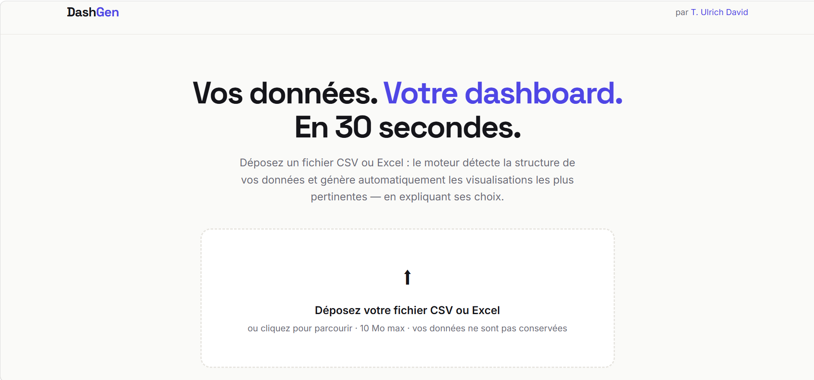
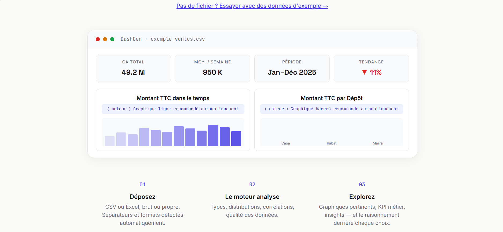
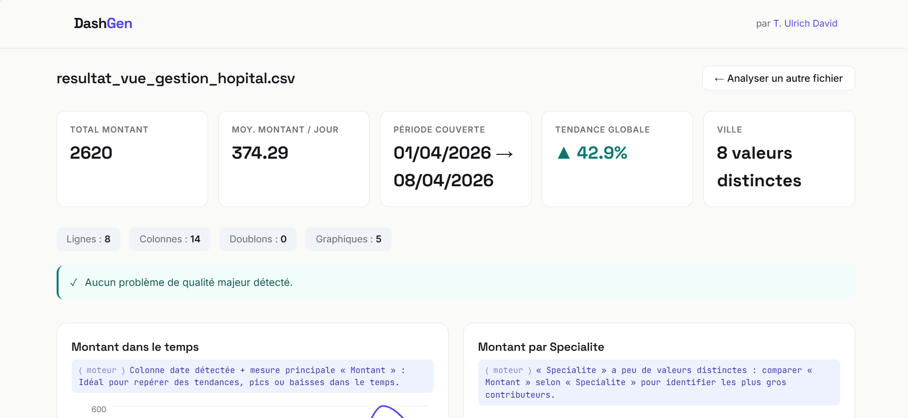
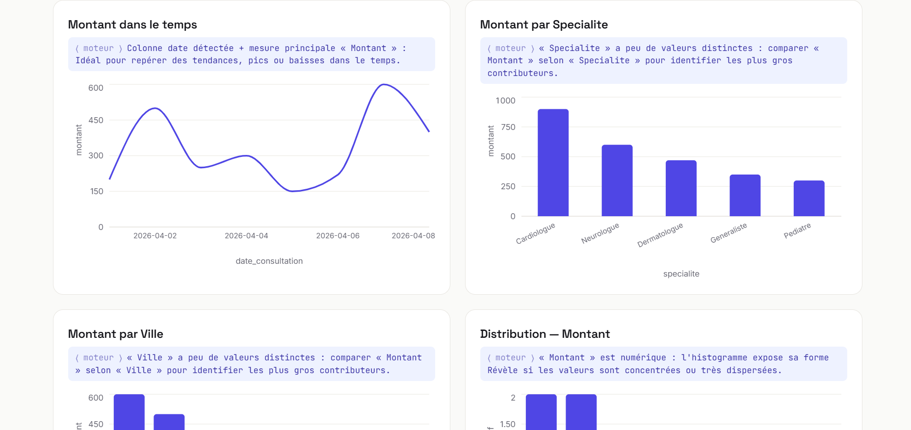
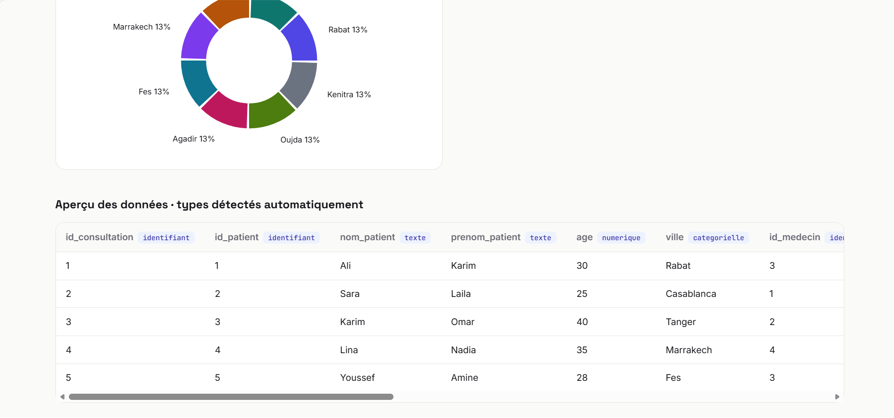

# DashGen — Votre dashboard en 30 secondes

> Déposez un fichier CSV ou Excel : le moteur détecte la structure de vos données et
> génère automatiquement les visualisations les plus pertinentes — en expliquant chacun
> de ses choix.
>
> 🔗 **[Démo live](https://VOTRE-SPACE.hf.space)** 









## Comment ça marche

```
Fichier CSV/XLSX ──> Profiler ──────> Recommender ──────> Frontend React
                     détection de      sélection des       rendu des graphiques
                     types, stats,     graphiques +        + insights + aperçu
                     qualité           données agrégées
```

1. **Profiler** (`backend/profiler.py`) — détection intelligente des types de colonnes :
   dates (même en texte, formats mélangés), numériques (même avec virgules, %, devises),
   catégorielles, booléens, identifiants. Statistiques et qualité (manquants, doublons).
2. **Recommender** (`backend/recommender.py`) — règles de sélection des visualisations :
   - date + mesure → série temporelle (granularité jour/semaine/mois automatique)
   - catégorielle + mesure → barres agrégées
   - paire numérique corrélée (>0.3) → nuage de points
   - mesure principale → histogramme · catégorielle → répartition
   Chaque graphique est accompagné du **raisonnement du moteur** — la signature du produit.
3. **Insights** — constats automatiques : doublons, colonnes très incomplètes,
   classes déséquilibrées, valeurs extrêmes (3×IQR).
4. **Frontend React** (`frontend/`) — upload drag & drop, loader « moteur », grille de
   graphiques Recharts, aperçu des données avec badges de types.

## Lancer en local

```bash
# Backend (sert aussi le frontend buildé depuis backend/static/)
cd backend
pip install -r requirements.txt
uvicorn main:app --reload --port 8000
# → http://localhost:8000

# Frontend en mode dev (optionnel, proxy /api vers :8000)
cd frontend
npm install
npm run dev
```

Rebuilder le frontend : `cd frontend && npm run build && cp -r dist/* ../backend/static/`

## Déploiement (HuggingFace Spaces, gratuit)

1. Créer un Space → SDK **Docker**
2. Pousser le repo (le `Dockerfile` à la racine est détecté automatiquement)
3. L'application est servie sur le port 7860 — rien d'autre à configurer

## Limites du démonstrateur

- 10 Mo / 100 000 lignes max par fichier
- Les fichiers ne sont jamais écrits sur disque : analyse en mémoire, aucune conservation

## Stack

FastAPI · pandas · React · Vite · Recharts

---

**Tassembedo Ulrich David** — Data Science & IA · [GitHub](https://github.com/Davlamelo)
